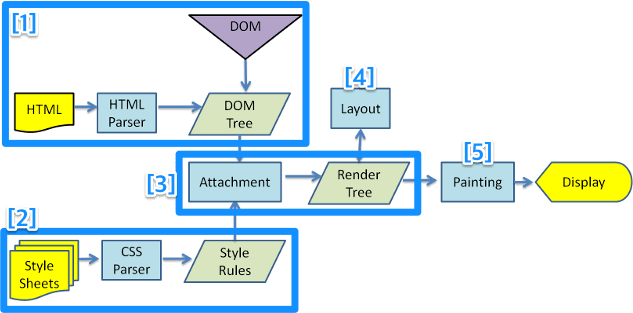

# 웹의 개요
## 마크업의 개념
배경: network 상에서 전자 문서 교환할 때 format이 맞지 않아, 표준을 맞추기 위해 마크업 개념이 나옴.

최초의 마크업은 절차적 마크업 언어인 SGML(Standard generalized markup language)가 탄생함.   

현대 웹에서 절차적 언어 대신 HTML을 많이 사용함
### HTML
- Hyper text markup language
- 한쌍의 tag 명령으로 이루어짐   
ex) \<header> \</header>
- 태그 - 속성으로 옵션을 줌

## 웹 어플리케이션 아키텍쳐


## 웹 프로토콜

웹 브라우저와 백엔드 서버와의 request와 response로 통신한다.

## 렌더링 엔진
[렌더링 엔진 참조][렌더링 엔진 링크] 
[렌더링 엔진 링크]: (https://janghanboram.github.io/2018/06/06/browser-rendering/)  
브라우저의 렌더링 엔진은 서버로부터 받은 내용을 브라우저에 표시하는 역할을 한다.
다시 말해서, 서버로부터 받은 내용(HTML, CSS, Javascript ..등의 파일)을 변환해서 화면에 픽셀 단위로 나타내는 과정이다.



1. DOM(document object model) 생성
2. CSSOM (css object model) 생성
3. Render Tree(DOM + CSSOM) 생성
4. Render Tree 배치
5. Render Tree 그리기
위의 5개의 단계를 거치며, CSSOM을 따로 표기하지 않고 4 단계로 표현하기도 한다.

## DOM

문서 객체 모델(The Document Object Model, 이하 DOM)은 HTML, XML 문서의 프로그래밍 interface 이다.

쉽게 생각하면, DOM은 웹 페이지의 객체 지향 표현입니다.

```html
<!DOCTYPE html>
<html lang="en">
<head>
    <meta charset="UTF-8">
    <meta name="viewport" content="width=device-width, initial-scale=1.0">
    <title>Document</title>
    <script src="https://unpkg.com/@babel/standalone/babel.min.js"></script>    
</head>
<body>
</body>
</html>
```
위의 html 코드를 DOM으로 표현하면 아래 그림 처럼 트리 구조로 표현할 수 있다.   


### http request와 response
[참조](https://velog.io/@bky373/Web-HTTP%EC%99%80-HTTPS-%EC%B4%88%EA%B0%84%EB%8B%A8-%EC%A0%95%EB%A6%AC)


## 웹 디버깅 추천 extension
- live server -> html test 하기 좋음
<!-- - react extension pack -->
<!-- - material icon thema  -->

# 참조
렌더링 엔진: https://janghanboram.github.io/2018/06/06/browser-rendering/

dom: https://velog.io/@spig0126/DOM%EC%9D%B4%EB%9E%80